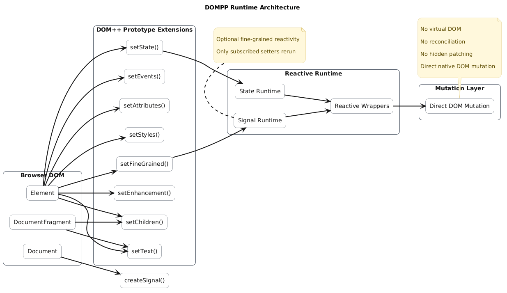
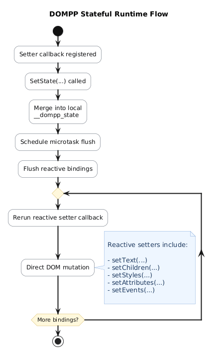
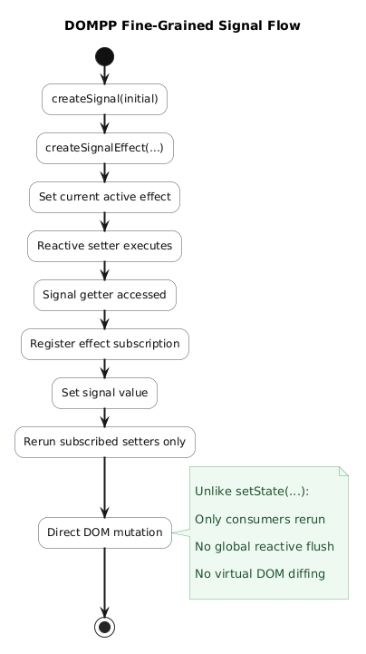
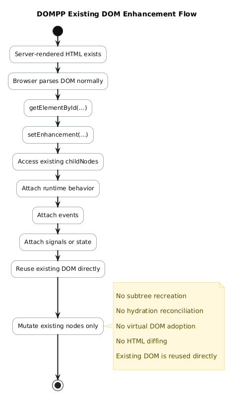
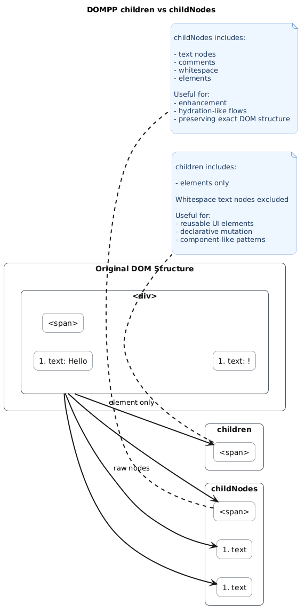
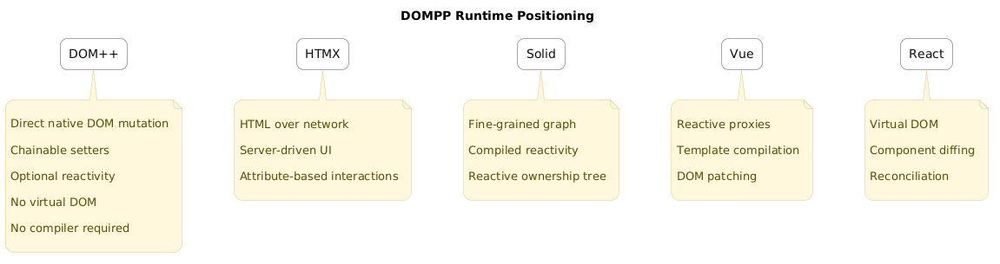
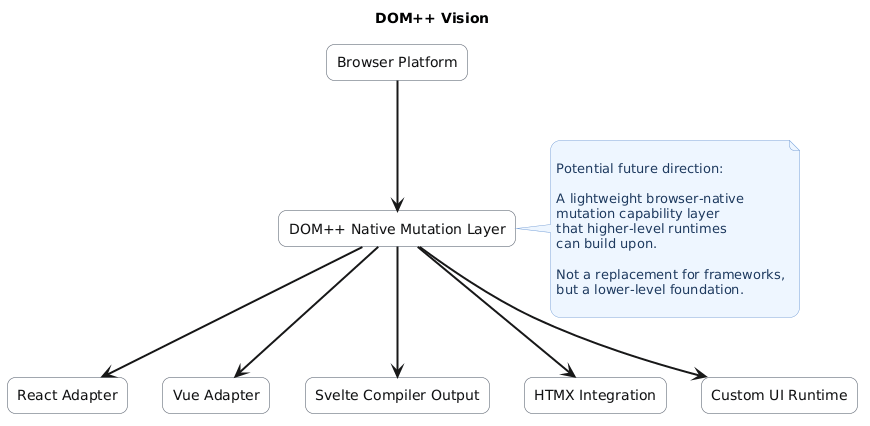

# DOMPP Architecture

This directory contains architectural diagrams and runtime flow documentation for DOMPP.

The goal of these diagrams is to explain:

* how DOMPP mutates the DOM
* how reactivity works internally
* how signals propagate updates
* how enhancement differs from hydration
* how DOMPP positions itself architecturally

DOMPP intentionally prioritizes:

* native DOM mental models
* deterministic mutation
* minimal abstraction
* explicit runtime behavior

---

# Runtime Architecture

DOMPP extends native DOM APIs with small chainable setters and optional reactive runtimes.

Unlike virtual DOM frameworks, DOMPP performs direct deterministic DOM mutation.



Key ideas:

* direct DOM mutation
* no virtual DOM
* no reconciliation engine
* optional runtime layers
* native DOM remains primary

---

# Stateful Runtime

DOMPP includes a lightweight stateful runtime using `setState(...)`.

Reactive setter callbacks rerun after state changes.



Flow:

1. local state mutation
2. microtask scheduling
3. binding flush
4. setter rerun
5. direct DOM mutation

This model is intentionally simple and explicit.

---

# Fine-Grained Signals

DOMPP also supports optional fine-grained signal reactivity.



Unlike the stateful runtime:

* only signal consumers rerun
* no global reactive flush occurs
* reruns remain granular and explicit

Signals are fully opt-in through:

```js
.setFineGrained()
```

DOMPP still supports the original stateful runtime model.

---

# Existing DOM Enhancement

DOMPP supports enhancement-style runtime attachment for server-rendered or static HTML.



This allows:

* existing DOM reuse
* direct node adoption
* hydration-like flows
* progressive enhancement

Without:

* virtual DOM hydration
* subtree recreation
* reconciliation passes
* HTML diffing

The existing DOM itself becomes the runtime target.

---

# children vs childNodes

DOMPP intentionally exposes both:

* `children`
* `childNodes`

because enhancement and DOM reuse often require exact structural access.



## children

Includes:

* element nodes only

Excludes:

* text nodes
* whitespace nodes
* comments

Useful for:

* reusable UI structures
* declarative element mutation
* component-like patterns

---

## childNodes

Includes:

* text nodes
* whitespace nodes
* comments
* elements

Useful for:

* enhancement
* hydration-like assimilation
* preserving exact DOM structure

---

# Runtime Positioning

DOMPP occupies a different runtime philosophy compared to many modern UI systems.



DOMPP focuses on:

* native DOM mutation
* optional reactivity
* deterministic updates
* minimal runtime orchestration

Rather than:

* virtual DOM ownership
* hidden reconciliation
* template compilation
* framework abstraction layers

---

# DOMPP Vision

DOMPP also explores the idea of a lightweight DOM mutation capability layer that higher-level runtimes could potentially build upon.



This is not intended as a replacement for frameworks.

Instead, DOMPP explores whether:

* native DOM mutation ergonomics
* optional reactivity
* enhancement-based runtime attachment

could function as lower-level browser-native UI primitives.

Potential future integrations could include:

* JSX transforms
* template compilers
* SSR enhancement systems
* framework adapters
* custom runtime layers

while preserving direct DOM access underneath.

---

# Notes

These diagrams are conceptual runtime documentation.

They are intended to help contributors and readers understand:

* architectural direction
* runtime flow
* internal design philosophy
* reactive behavior
* mutation strategy

rather than serving as strict implementation specifications.
